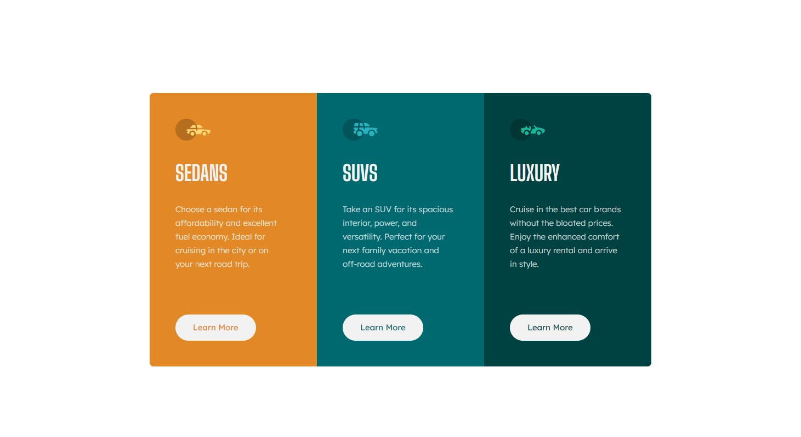

# Frontend Mentor - 3-column preview card component solution

This is a solution to the [3-column preview card component challenge on Frontend Mentor](https://www.frontendmentor.io/challenges/3column-preview-card-component-pH92eAR2-). Frontend Mentor challenges help you improve your coding skills by building realistic projects. 

## Table of contents

- [Overview](#overview)
  - [The challenge](#the-challenge)
  - [Screenshot](#screenshot)
  - [Links](#links)
- [My process](#my-process)
  - [Built with](#built-with)
  - [What I learned](#what-i-learned)
  - [Continued development](#continued-development)
- [Author](#author)

**Note: Delete this note and update the table of contents based on what sections you keep.**

## Overview

### The challenge

Users should be able to:

- View the optimal layout depending on their device's screen size
- See hover states for interactive elements

### Screenshot

- Solution URL: [https://github.com/laurel-ray/3-column-preview-card-component-main](https://your-solution-url.com)
- Live Site URL: [https://laurel-ray.github.io/3-column-preview-card-component-main/](https://your-live-site-url.com)

## My process

### Built with

- html5
- CSS 
- Flexbox
- Sass

### What I learned

Get the thing functional and looking vaguely similar and THEN tinker with the design to get it just right. 

### Continued development

I need more practice with layout stuff. I was thorougly confused and just stumped for a long time trying to figure out why my flexbox container wouldn't center. I'm still not 100% sure why, but it had something to do with the viewport height being in the wrong place. 

## Author

- Frontend Mentor - [@laurel-ray](https://www.frontendmentor.io/profile/laurel-ray)

